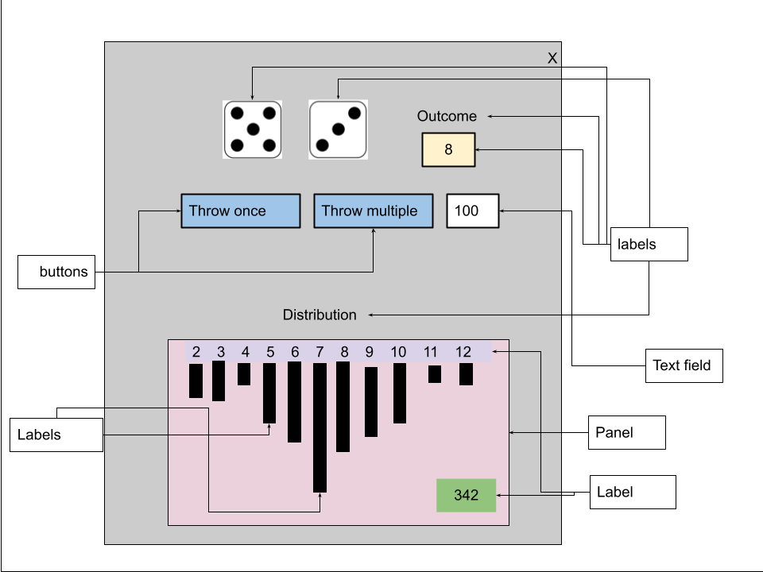

# Dice Game Statistics
Below are the probabilities of the outcomes when throwing two dice:
- The chance of rolling a total of 2 is 2.78 percent
- The chance of rolling a total of 3 is 5.56 percent
- The chance of rolling a total of 4 is 8.33 percent
- The chance of rolling a total of 5 is 11.11 percent
- The chance of rolling a total of 6 is 13.89 percent
- The chance of rolling a total of 7 is 16.67 percent
- The chance of rolling a total of 8 is 13.89 percent
- The chance of rolling a total of 9 is 11.11 percent
- The chance of rolling a total of 10 is 8.33 percent
- The chance of rolling a total of 11 is 5.56 percent
- The chance of rolling a total of 12 is 2.78 percent

## Task:
Design, implement, test, and improve a GUI program that would simulate two dice throw and display in real time:
- the outcome of each dice as image
- the total of the outcome
- the outcome distribution as a bar graph
- the total number of throws
- the highest consecutive outcome (*)

The user can simulate a singular throw, or a multiple of throws at once. The higher the number of throws the faster the simulation will go.

### GUI
The interface should look like the image below:

Here is a suggestion of Swing elements you might use:


### Engineering report
You are to complete the analysis, calendar, design, code, testing, improvements, and complete an engineering report using the following [template](https://docs.google.com/document/d/1PA0ZXU9M8tLMTIUq6R461H6lZX_A3xRRneBTlcLKo6g/copy)

### Tools/Concepts
  1. Java Swing Elements - to create GUI
  2. Array - to store swing elements, etc.
  3. ArrayList - to store all outcomes
  4. Random class - to randimze dice throw
  5. javax.swing.Timer - used to animate dice throwing
  6. ActionEvent and  ActionListener - to control user actions
  7. Methods
  8. Testing
  10. try and catch for data validation
  11. Manipulating, searching arrays and arraylists
  12. etc.

### Final products
- engineering report as pdf submitted in D2L
- the complete code here
### Checklist
- #### Code:
  - comments
  - naming
  - indentation and spacing
  - methods
  - efficiency
  - readability
  - correctness
  - proper testing
  - on time (Check due date)
  - original work
- #### Report
  - PDF
  - on time (Check due date)
  - all components completed
  - original work
### Example of program running
[](https://clipchamp.com/watch/6sCucWO80hU)

### Helpful hints and code
- Complete your calendar daily and modify tasks and their status as needed
- Break the code down to as many methods as possible
  - List the steps that your program must go through. Most likely they become methods!
- Use arrays to store the names of the image files
- Use arrays to store the labels used as bars in the graph
- Use array list to store all the outcomes as they happen
- Implementing a Timer to animate parts of swing application
```java
 javax.swing.Timer t = new javax.swing.Timer(100, new ActionListener() {
    public void actionPerformed(ActionEvent e) {
      //statements to be executed during an interval of 100 ms
      if (/**Condition to be true to stop timer*/) {
        ((javax.swing.Timer) e.getSource()).stop(); //stop time
      }
    }
  }); //End of Timer delcaration and intialization
  t.start(); //Start the timer
```
- Adding image to a label
```java
lblImage = new JLabel(new ImageIcon("imageFileName"));
```
- Being able to change colour of labels or text field elements
```java
lblOutcome.setOpaque(true);
lblOutcome.setBackground(new Color(255, 255, 204));
```